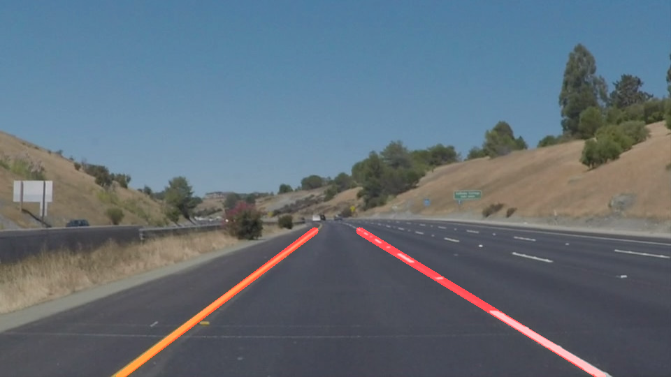

# **Finding Lane Lines on the Road** 

Overview
---

When we drive, we use our eyes to decide where to go.  The lines on the road that show us where the lanes are act as our constant reference for where to steer the vehicle.  Naturally, one of the first things we would like to do in developing a self-driving car is to automatically detect lane lines using an algorithm.

In this project we will detect lane lines in images using Python and OpenCV.  OpenCV means "Open-Source Computer Vision", which is a package that has many useful tools for analyzing images.  

My Approach
---
In my approach, First, I used the canny edge detection and hough transform to form the basic pipeline. And then I improved the pipeline by tuning the parameters for the functions. And then I explored different colorspaces to find the optimal colorspace. Using this colorspace, I detected the lanes by applying ROI mask to the colorspace image. And then I used Hoough transform to determine all the lines in the ROI. The determined lines are then extrapolated using average slope and intercepts.

Reflection
---

## Pipeline ##

In the first step, I converted the RGB image to a grayscale image. For this, I used cv2.COLOR_RGB2GRAY class from the OpenCV Library. This converts the image into a 2d array which consistes of only the intensity information.

In the second step, I used the HLS colorspace to detect the lane lines on the road. For this, I used cv2.COLOR_RGB2HLS class from OpenCV library. This converts the image to HLS format which has Hue, Light and Saturation information. And then I used two masks, one for yellow color and the other for white color to detect the lanes. By applying the suitable range of thresholds to this class, we can detect the lanes in the image. The following image shows the output of this transformation.

In the next step, I used gaussian blur function to average the pixels around a kernel and then I used the Canny Edge detection to detect the edges of the lanes in the image. For this OpenCV has a function which takes the image and the thresholds as input. The output image is the binary image with edges. The following image shows the output of this function.

Next step is to apply a mask to the image to get the desired Region of Interest in the image. Our ROI is the region where lane lines are in the image. I defined the vertices of the mask and used the OpenCV fillPoly function to apply mask to the image. The following images shows the output of this function when we input edges image and hls image respectively.

In the next step, I used Hough transform to determine the lines in the image using the edges that we determined used Canny. The output of this function are all the lines that are detected in the image. This function takes image and hough transform parameters and returns the lines detected in the image.

Next step is to seperate these lines to left and right lanes. For this, I modified the drawlines() function. I seperated the lanes to left and right by determing the slope of each line. If the slope is greater than zero it is right lane and if it is less than zero then it is a left lane. I also used the image center to determine the left and right lanes. This makes the detection much more robust. After determing the left and right lanes, I determined their mean slope and intercepts. I used these slopes and intercepts to draw a single line to the left lane and another line to the right lane. The output of this function is shown below. Next I used the weighted_img function to draw the weighted mean of all these lines. The final output of the image is shown below.

The final step is to applying the pipeline to the videos. Videos are nothing but series of images. For this, we use the moviepy library. The fl_image class in moviepy applies the pipeline to every frame of the video and outputs the corresponding outputs to each frame. 

## Potential Shortcomings ##

Although it detects the lanes in straight roads, it fails to detect them on the curved roads. The curved roads has curvature which cannot be fitted by first order polynomial or linear equation. It also fails to detect the lanes when there is a shadow of trees on the road. This can be avoided by enhancing the image. Another potential shortcoming would be due to the weather conditions (low light, rainy day, etc). The camera must be fixed and if it moves, the ROI will change. Also the it only works when the camera is in the center of the lane, It fails suring lane changing.

## Possible Improvements ##

One of the possible improvements would be by fitting the lanes with a polynomial of order 2. The road curvature can be fitted on a circle with radius equal to radius of curvature. This makes the lane detection much more robust. Another possibile improvement is to enchance the image using filters so that the shadows won't effect the lane detection using the HLS colorspace.